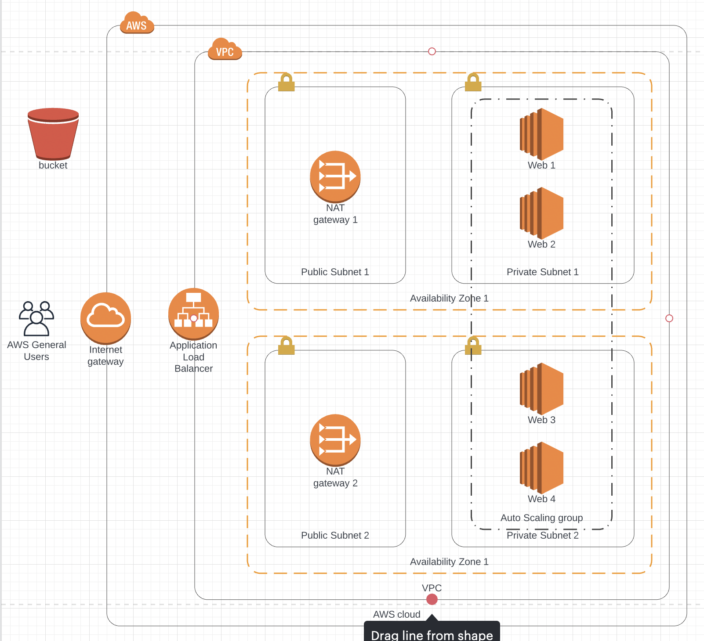

# Web App Terraform

A simple web application deployed on AWS using Terraform. This project does not focus on creating a web application rather how to deploy it on AWS and autoscale it according to the traffic. For this purpose, EC2 instances are running in an Autoscaling Group. To expose the application to the world, an Application Load Balancer is attached to the Autoscaling group.

## Architecture

<p align="middle">
  
</p>

As it can be seen the EC2 instances (Web servers) are deployed in a private subnets to make sure they are not accessible publicly. The application is also deployed in two different Availability Zones for high availability.

## Prerequisites

AWS Command Line Interface (AWS CLI) and Terraform need to be installed and configured in order to run this application

* Follow [this](https://docs.aws.amazon.com/cli/latest/userguide/getting-started-install.html) guide to install AWS CLI.
* Follow [this](https://docs.aws.amazon.com/cli/latest/userguide/cli-configure-quickstart.html) guide to configure AWS CLI.
* Follow [this](https://learn.hashicorp.com/tutorials/terraform/install-cli) guide to install Terraform.

## How to run

* Upload your zipped build archive to the S3 bucket. A sample hello world build archive is included [here](./project-archive.zip).
* Deploy the application

```bash
terraform apply 
  -var environment=<environment-name>  # e.g. dev, staging, production
  -var s3_bucket=<s3-bucket-name>
  -var archive_path=<archive-path-in-s3>
```

**Note:** You can find more variables like changing the minimum and maximum number of EC2 instances in [variables.tf](./variables.tf).

## Delete Provisioned Resources

Run the following command to destroy all the provisioned resources

```bash
terraform destroy 
  -var environment=<environment-name>  # e.g. dev, staging, production
  -var s3_bucket=<s3-bucket-name>
  -var archive_path=<archive-path-in-s3>
```

**Tip:** Instead of specifying all the variables in the terminal, they can also be placed in `terraform.tfvars` file.

## Contact

You can get in touch with me on LinkedIn: [Farhan Shoukat](https://www.linkedin.com/in/farhan-shoukat/)

## License

[MIT](./LICENSE) Copyright (c) 2022 Farhan Shoukat
